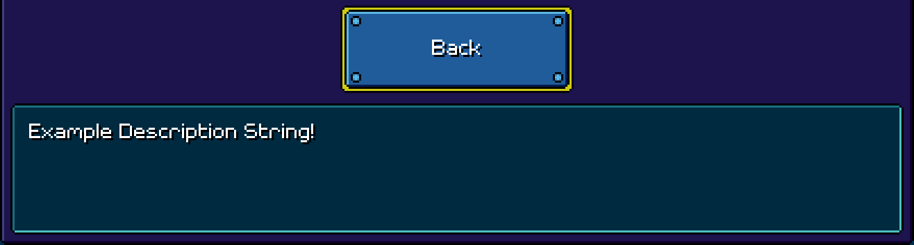

# Quest Utils
A modding library for making Rhythm Quest mods.
(CURRENTLY, THIS REPO IS ONLY USED FOR DOCUMENTATION ABOUT THE ACTUAL GAME'S CLASSES. THE PLUGIN HAS NOT YET BEEN CREATED.)
## SelectableDescription
Class put onto buttons in some extra and settings menu. Used to update the description text shown at the bottom of the menu.
### _descriptionKey
Value type: String
Sets the text in the description box to the text in the "Main String Table" string table.  
  
Example:
```C#
LocalizationSettings.StringDatabase.GetTable("Main String Table").AddEntry("example_string", "Example Description String!");
ButtonGameObject.GetComponent<SelectableDescription>()._descriptionKey = "example_string";
```
Expected output:

